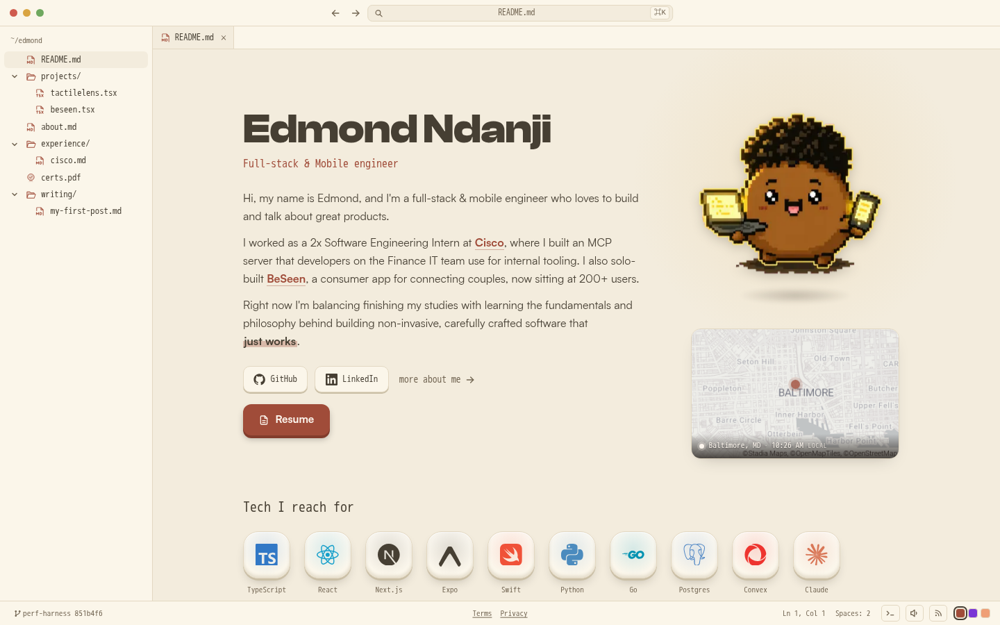

# eddyb.dev

My personal portfolio and blog, built to feel like a code editor. Underneath the
editor chrome it's just plain, fast web pages, so it still works for search
engines and with JavaScript turned off.



## What it is

The pages are ordinary routes: home, projects, about, experience, certifications,
and writing. On top of them sits an editor-style interface, a file-tree explorer,
a command palette, tabs, a status bar, and a terminal with a few easter eggs.
That interface is only a layer, so search engines and visitors without
JavaScript get the plain pages underneath.

## What inspired it

I spend most of my day in a code editor, so I wanted the place that represents
me to feel like one, without it becoming a gimmick. Same warm, single-palette
calm I like in my own tools, a few small touches for people who go looking, and
underneath it all just normal pages that load fast and work everywhere.

It mirrors how I like to build: software that is non-invasive and carefully
crafted, simple on the surface and honest underneath.

## Stack

- **Next.js 16** (App Router) with the React Compiler, on **React 19**
- **Tailwind CSS v4** (Lightning CSS)
- **TypeScript**, end to end
- **MDX** writing via `next-mdx-remote`, build-time highlighting with
  `prism-react-renderer` (server-rendered, no client JS)
- **Clash Display** + **Satoshi** typefaces
- Deployed on **Vercel**

## Performance

The repo carries its own perf harness. A single `budgets.json` is the source of
truth for every gate, and CI runs them on each push:

- **Bundle:** `size-limit` over the initial-load JS union (lazy chunks excluded)
- **Lab vitals:** Lighthouse LCP / CLS / TBT against the budget
- **Interaction:** an INP check
- **Accessibility:** Playwright + axe invariants that must stay green

```bash
pnpm perf        # build + size-limit + perf e2e + perf-check
pnpm e2e         # accessibility invariants
```

## Project structure

```
app/            App Router routes + lib (nav, posts, git, palette)
components/     IDE shell (ide/), content primitives, feel/ (sound, cursor)
content/blog/   MDX posts
data/           projects, experience, skills, certs, profile
tools/          perf-check CLI and gate engines
e2e/            Playwright invariants + perf specs
```

Content is data-driven: edit the files in `data/` and the MDX in `content/blog/`,
and the routes, file tree, and search index follow.

## License

**All Rights Reserved.** This source is published publicly for viewing and
educational reference only. You may **not** copy, clone, reuse, redistribute, or
deploy this site (code or content) in whole or in substantial part without
explicit written permission. See [LICENSE](./LICENSE) for the full terms.

## Links

- **Live:** [eddyb.dev](https://eddyb.dev)
- **GitHub:** [@2bTwist](https://github.com/2bTwist)
- **LinkedIn:** [Edmond Batchankwe](https://www.linkedin.com/in/edmond-batch)
